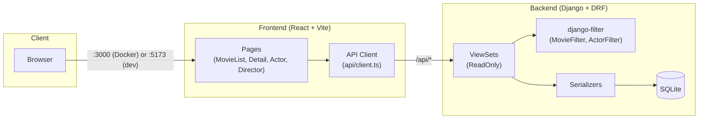
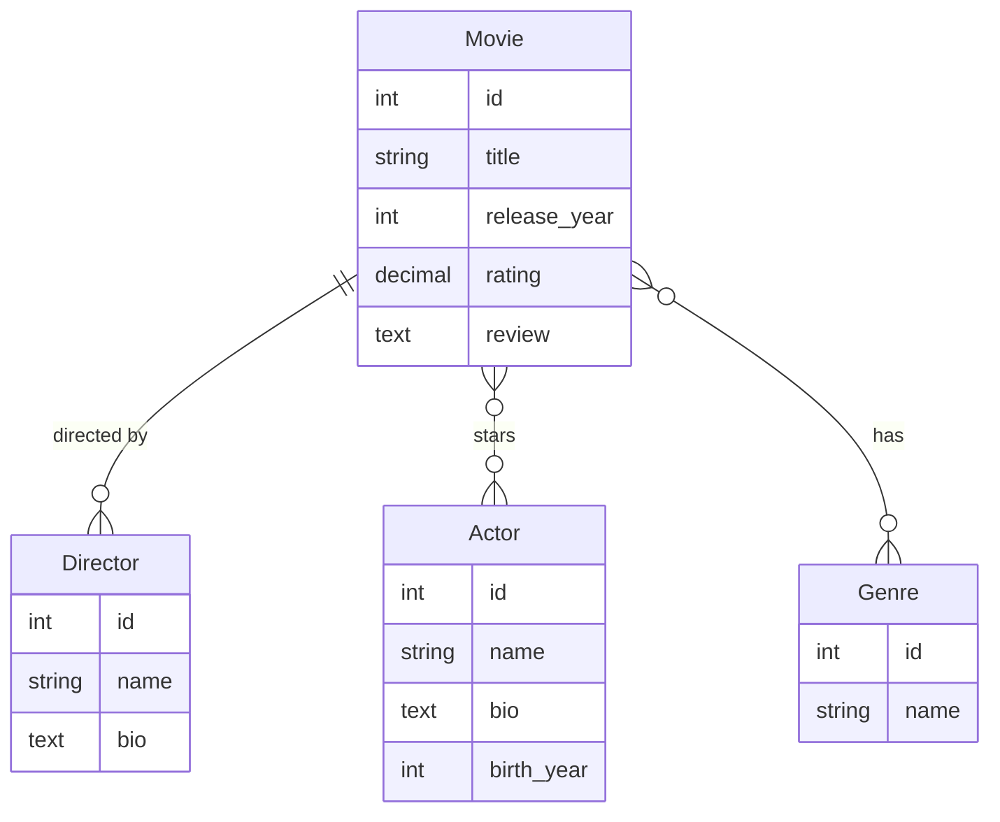

# Movie Explorer

A full-stack Movie Explorer platform for browsing movies, actors, directors, and genres. Built as a take-home assignment demonstrating Django REST Framework backend filtering and a React frontend.

---

## Table of Contents

- [Architecture](#architecture)
- [Tech Stack](#tech-stack)
- [Scope](#scope)
- [Features](#features)
- [Quick Start (Docker)](#quick-start-docker)
- [Local Development](#local-development)
  - [Backend Setup](#backend-setup)
  - [Frontend Setup](#frontend-setup)
- [API Reference](#api-reference)
- [Data Model](#data-model)
- [Docker Setup](#docker-setup)
- [Running Tests](#running-tests)
- [Project Structure](#project-structure)
- [Environment Variables](#environment-variables)
- [Seed Data](#seed-data)
- [Edge Cases](#edge-cases)

---

## Architecture

The application follows a classic **decoupled SPA + REST API** pattern. The React frontend talks to the Django backend over HTTP; all filtering happens server-side via query parameters.



### Request flow

1. User interacts with a React page (e.g. filter bar on the movie list).
2. The frontend calls `apiFetch()` with query params — no client-side filtering.
3. DRF ViewSets apply `django-filter` backends and return paginated JSON.
4. Serializers shape list vs. detail responses (e.g. movie detail includes cast and review).

### Key design decisions

| Decision | Rationale |
|----------|-----------|
| Read-only API | Assignment scope is browse/filter only — no create/update/delete |
| Server-side filtering | Ensures consistent results and scales with pagination |
| SQLite | Zero-config local dev; sufficient for demo/assignment scale |
| Separate list/detail serializers | Lighter payloads on list endpoints; full data on detail |
| Gunicorn in Docker | Production-style WSGI server; dev uses `runserver` |

---

## Tech Stack

| Layer | Technology |
|-------|------------|
| **Backend** | Python 3.12, Django 6, Django REST Framework |
| **API docs** | drf-spectacular (OpenAPI / Swagger UI) |
| **Filtering** | django-filter (server-side query params only) |
| **Database** | SQLite |
| **CORS** | django-cors-headers |
| **Frontend** | React 19, TypeScript, Vite 8, Tailwind CSS 4 |
| **Routing** | React Router v7 |
| **Testing** | Django `TestCase` + Vitest / Testing Library |
| **Containerization** | Docker, Docker Compose, Nginx (frontend), Gunicorn (backend) |

---

## Scope

### In scope

- Browse movies with title, release year, genres, director, and rating
- **Server-side** filtering of movies by genre, director, actor, or release year
- Movie detail page with cast, director, genres, rating, and review
- Actor and director profile pages with filmography
- Paginated list endpoints (50 items per page)
- OpenAPI / Swagger documentation
- Seed data for local development and demos
- Docker Compose for one-command startup
- Automated tests (backend API + frontend components)

### Out of scope

- User authentication and authorization
- Create, update, or delete operations (read-only API)
- Client-side filtering or search
- Production database (PostgreSQL, etc.)
- CI/CD pipelines
- Image/poster assets for movies

---

## Features

- Movie list with filter bar (genre, director, actor, release year)
- Movie detail with full cast, review, and linked director/actor profiles
- Actor and director pages with bio and filmography
- Empty-state and error banners for no results or API failures
- Swagger UI for interactive API exploration

---

## Quick Start (Docker)

The fastest way to run the full stack:

```bash
git clone <your-repo-url>
cd MOVIE_PROJECTS
docker compose up --build
```

| Service | URL |
|---------|-----|
| **Frontend** | http://localhost:3000 |
| **Backend API** | http://localhost:8000/api/ |
| **Swagger UI** | http://localhost:8000/api/schema/swagger-ui/ |
| **OpenAPI schema** | http://localhost:8000/api/schema/ |

On startup, the backend container automatically runs migrations and seeds the database.

---

## Local Development

### Backend Setup

**Prerequisites:** Python 3.12+

```bash
cd backend
python -m venv .venv
source .venv/bin/activate          # Windows: .venv\Scripts\activate
pip install -r requirements.txt
python manage.py migrate
python manage.py seed_movies       # populate sample data (idempotent)
python manage.py runserver
```

| Item | Value |
|------|-------|
| API base URL | http://localhost:8000 |
| Admin (optional) | http://localhost:8000/admin/ |
| Swagger UI | http://localhost:8000/api/schema/swagger-ui/ |

**Useful commands:**

```bash
python manage.py test              # run API tests
python manage.py seed_movies         # seed only if DB is empty
python manage.py createsuperuser   # optional, for Django admin
```

### Frontend Setup

**Prerequisites:** Node.js 20+

```bash
cd frontend
npm install
npm run dev
```

| Item | Value |
|------|-------|
| Dev server | http://localhost:5173 |
| API target | `VITE_API_URL` (default: `http://localhost:8000`) |

**Available scripts:**

| Script | Description |
|--------|-------------|
| `npm run dev` | Start Vite dev server with HMR |
| `npm run build` | Lint → test → typecheck → production build |
| `npm run lint` | Run ESLint |
| `npm run test` | Run Vitest unit tests |
| `npm run preview` | Preview production build locally |

**Frontend routes:**

| Route | Page |
|-------|------|
| `/` | Movie list with filters |
| `/movies/:id` | Movie detail |
| `/actors/:id` | Actor profile + filmography |
| `/directors/:id` | Director profile + filmography |

---

## API Reference

All endpoints are **read-only** (`GET` only). Responses are paginated with `count`, `next`, `previous`, and `results` (page size: **50**).

### Movies

| Method | Endpoint | Description |
|--------|----------|-------------|
| `GET` | `/api/movies/` | List movies |
| `GET` | `/api/movies/{id}/` | Movie detail (includes actors, review) |

**Query filters** (`/api/movies/`):

| Param | Type | Description |
|-------|------|-------------|
| `genre` | string | Genre name (case-insensitive exact match), e.g. `Action` |
| `director` | integer | Director ID |
| `actor` | integer | Actor ID |
| `release_year` | integer | Release year, e.g. `2010` |

**Example:**

```http
GET /api/movies/?genre=Action&director=1&release_year=2010
```

**List response shape:**

```json
{
  "count": 1,
  "next": null,
  "previous": null,
  "results": [
    {
      "id": 1,
      "title": "Inception",
      "release_year": 2010,
      "director": { "id": 1, "name": "Christopher Nolan" },
      "genres": [{ "id": 1, "name": "Action" }],
      "rating": "8.8"
    }
  ]
}
```

### Actors

| Method | Endpoint | Description |
|--------|----------|-------------|
| `GET` | `/api/actors/` | List actors |
| `GET` | `/api/actors/{id}/` | Actor detail (includes filmography) |

**Query filters** (`/api/actors/`):

| Param | Type | Description |
|-------|------|-------------|
| `movie` | integer | Filter actors who appeared in this movie |
| `genre` | string | Filter actors who appeared in movies of this genre |

### Directors

| Method | Endpoint | Description |
|--------|----------|-------------|
| `GET` | `/api/directors/` | List directors |
| `GET` | `/api/directors/{id}/` | Director detail (includes filmography) |

### Genres

| Method | Endpoint | Description |
|--------|----------|-------------|
| `GET` | `/api/genres/` | List all genres (used by filter dropdowns) |

### Documentation endpoints

| Method | Endpoint | Description |
|--------|----------|-------------|
| `GET` | `/api/schema/` | OpenAPI 3 schema (JSON/YAML) |
| `GET` | `/api/schema/swagger-ui/` | Interactive Swagger UI |

---

## Data Model



| Model | Fields | Notes |
|-------|--------|-------|
| **Genre** | `name` | Unique; ordered alphabetically |
| **Director** | `name`, `bio` | One-to-many with movies |
| **Actor** | `name`, `bio`, `birth_year` | Many-to-many with movies |
| **Movie** | `title`, `release_year`, `rating`, `review` | Rating 0–10; review optional |

---

## Docker Setup

### Services

`docker-compose.yml` defines two services:

| Service | Image build | Port | Description |
|---------|-------------|------|-------------|
| `backend` | `./backend/Dockerfile` | `8000:8000` | Django + Gunicorn (2 workers) |
| `frontend` | `./frontend/Dockerfile` | `3000:80` | Nginx serving Vite production build |

### Backend container lifecycle

1. Runs `python manage.py migrate --noinput`
2. Runs `python manage.py seed_movies` (skips if already seeded)
3. Starts Gunicorn on `0.0.0.0:8000`

### Frontend container build

- Multi-stage build: Node 20 builds the SPA, Nginx Alpine serves static files
- `VITE_API_URL` is baked in at build time (default: `http://localhost:8000`)
- Nginx configured for SPA routing (`try_files` → `index.html`)

### Common Docker commands

```bash
docker compose up --build          # build and start
docker compose up -d               # detached mode
docker compose down                # stop and remove containers
docker compose logs -f backend     # tail backend logs
docker compose build frontend      # rebuild frontend only
```

### Environment overrides

Override backend env vars in `docker-compose.yml` or via a `.env` file:

```yaml
environment:
  DJANGO_DEBUG: "True"
  DJANGO_ALLOWED_HOSTS: "localhost,127.0.0.1,backend"
  CORS_ALLOWED_ORIGINS: "http://localhost:5173,http://127.0.0.1:5173,http://localhost:3000"
```

---

## Running Tests

### Backend

```bash
cd backend
source .venv/bin/activate
python manage.py test
```

Covers: list/detail endpoints, all movie filters, actor filters, 404 handling, empty filter results.

### Frontend

```bash
cd frontend
npm run lint          # ESLint
npm run test          # Vitest (FilterBar, MovieCard, EmptyState)
npm run build         # full pipeline: lint + test + typecheck + build
```

---

## Project Structure

```
MOVIE_PROJECTS/
├── backend/
│   ├── config/                 # Django project settings, URLs, WSGI
│   │   ├── settings.py
│   │   └── urls.py
│   ├── movies/                 # Core app
│   │   ├── models.py           # Genre, Director, Actor, Movie
│   │   ├── views.py            # ReadOnlyModelViewSets
│   │   ├── serializers.py      # List vs detail serializers
│   │   ├── filters.py          # MovieFilter, ActorFilter
│   │   ├── urls.py             # DRF router
│   │   ├── tests.py            # API integration tests
│   │   └── management/commands/
│   │       └── seed_movies.py  # Sample data seeder
│   ├── Dockerfile
│   ├── entrypoint.sh           # migrate → seed → gunicorn
│   └── requirements.txt
├── frontend/
│   ├── src/
│   │   ├── api/                # API client + endpoint helpers
│   │   ├── components/         # Layout, FilterBar, MovieCard, etc.
│   │   ├── pages/              # MovieList, MovieDetail, Actor, Director
│   │   └── types/              # TypeScript interfaces
│   ├── Dockerfile              # Node build → Nginx serve
│   ├── nginx.conf
│   └── package.json
├── docker-compose.yml
└── README.md
```

---

## Environment Variables

| Variable | Default | Used by | Description |
|----------|---------|---------|-------------|
| `VITE_API_URL` | `http://localhost:8000` | Frontend | Backend base URL (build-time for Docker) |
| `DJANGO_DEBUG` | `True` | Backend | Enable Django debug mode |
| `DJANGO_SECRET_KEY` | dev insecure key | Backend | Django secret key — **change in production** |
| `DJANGO_ALLOWED_HOSTS` | `localhost,127.0.0.1,backend` | Backend | Comma-separated allowed hosts |
| `CORS_ALLOWED_ORIGINS` | `http://localhost:5173,...` | Backend | Comma-separated frontend origins |

---

## Seed Data

Run `python manage.py seed_movies` to populate the database (skips if movies already exist):

| Entity | Count |
|--------|-------|
| Movies | 18 (with ratings; some with reviews) |
| Actors | 8 |
| Directors | 5 |
| Genres | 7 |

Genres: Action, Drama, Sci-Fi, Comedy, Thriller, Western, Documentary.

> **Note:** The "Documentary" genre has zero movies — useful for testing empty filter results.

---

## Edge Cases

| Scenario | Behavior |
|----------|----------|
| Invalid movie/actor/director ID | HTTP **404** |
| Filter with no matches (e.g. `genre=Documentary`) | HTTP **200**, empty `results` array |
| Invalid filter ID (e.g. `director=99999`) | HTTP **200**, empty list (not 500) |
| Movie without review | `review` field is empty string on detail |
| Backend unavailable | Frontend shows error banner |
| Re-run seed command | Skipped with warning if data already exists |
